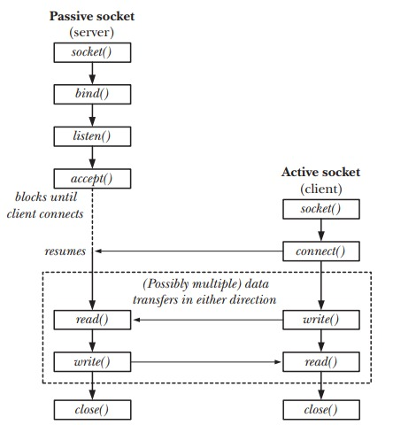

# minihttpd
A tiny web server built from scratch for learning purposes.

## Milestone 1: Build a TCP echo server

Build a TCP echo server following the image below.

Build:
- Create a stream socket
- Bind the socket into an address and port
- Accept the client
- Read raw data
- Send fixed response

Test:
```
nc 127.0.0.1 8080
```
<div style="text-align:center">
	
	<p><em>Overview of system calls used with stream socket</em></p>
</div>